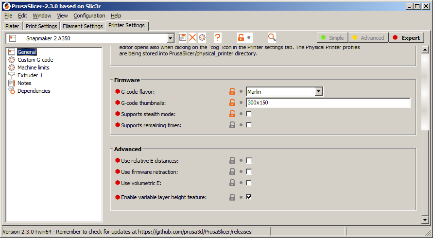

sm2pspp
=======

A **S**nap**m**aker **2**.0 **P**rusa**S**licer **P**ost-**P**rocessor to create compatible files for the Snapmaker terminal.

Features
========

This application can be added to PrusaSlicer as post-processing script which takes the generated G-Code and converts it in-place into a Snapmaker terminal compatible file by modifying the G-Code comment sections.

Usage
=====

* Store `sm2pspp` somewhere on your system.
* Enable thumbnail output in PrusaSlicer `Printer Settings/General/G-code thumbnails:` **300x150**.
  
* Add post-processing script in PrusaSlicer `Print Settings/Output options/Post-processing script:` *absolute path to sm2pspp*.
  

Building
========

The following dependencies are given:  
- C99

Edit Makefile to match your target system configuration.  
Building the program:  

    make

    

Files
=====

|Name           |Meaning
|---------------|--------------------------------------------
|*.mk           |Target specific Makefile setup.
|mingw-unicode.h|Unicode enabled main() for MinGW targets.
|parser.*       |Text parsers and parser helpers.
|target.h       |Target specific functions and macros.
|tchar.*        |Functions to simplify ASCII/Unicode support.
|sm2pspp.*      |Main application files.
|version.*      |Program version information.

License
=======

See [unlicense file](doc/UNLICENSE).  
